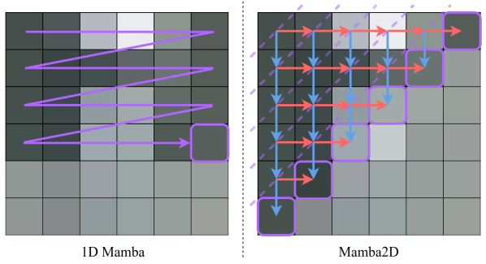
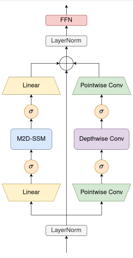
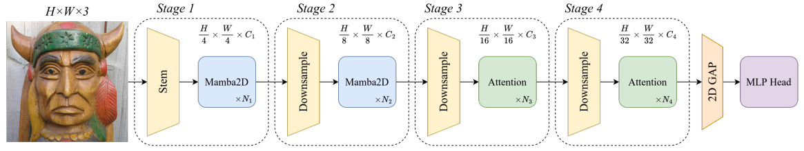

<div align="center">
<h1>Mamba2D </h1>
<h3>A Natively Multi-Dimensional State-Space Model for Vision Tasks</h3>

[Enis Baty](https://scholar.google.co.uk/citations?user=SYOXFuoAAAAJ)<sup>1</sup> \*, [Alejandro Hernández Díaz](https://scholar.google.es/citations?user=C0baOcEAAAAJ&hl=es)<sup>1</sup> \*, [Chris Bridges](https://scholar.google.es/citations?user=iySVX8MAAAAJ&hl=es)<sup>1</sup>, [Rebecca Davidson](https://scholar.google.es/citations?user=WT4Xq1UAAAAJ&hl=es)<sup>2</sup>, Steve Eckersley<sup>2</sup>, [Simon Hadfield](https://scholar.google.es/citations?user=KuQs_N0AAAAJ&hl=es)<sup>1</sup> 

<sup>1</sup>  University of Surrey, <sup>2</sup>  Surrey Satellite Technology Ltd

(\*) Joint first authorship

 ArXiv Preprint ([arXiv 2412.16146](https://arxiv.org/abs/2412.16146))

</div>

## Updates
- `2025-04-17`: Released pretrained weights for M2D-T available [here](https://github.com/cocoalex00/Mamba2D/releases/tag/v1.0.0).

## Introduction 
State-Space Models (SSMs) have gained attention as a powerful and efficient alternative to transformer architectures. However, existing SSM designs are often rooted in biases inherited from their origins in natural language processing, which limits their ability to effectively model the spatial dependencies inherent in visual data.

This repository introduces Mamba2D, a state-space model designed from a natively multidimensional perspective to address these limitations. Unlike prior approaches, which adapt 1D SSMs for 2D data (such as images) using arbitrary combinations of 1D scan directions, Mamba2D employs a single, unified 2D scan direction. This novel approach captures spatial dependencies across both dimensions simultaneously, enabling more effective construction of hidden states for visual inputs.

## Overview
- Our 2-dimensional selective SSM is designed to model complex spatial relationships efficiently with a custom wavefront CUDA kernel.

<div align="center">

</div>

- We introduce a novel mixer block by leveraging convolutions and SSMs to extract rich fine-grained and global features respectively.

<div align="center">

</div>


- The proposed block can be integrated with standard attention to form a powerful and efficient vision backbone.
<div align="center">

</div>


## Installation
1. Create conda environment
    ```bash
    conda create -n mamba2d python=3.11.9 
    conda activate mamba2d
    ```
2. Install ``torch`` (version 2.4.1)
    ```bash 
    conda install pytorch==2.4.1 torchvision==0.19.1 torchaudio==2.4.1 pytorch-cuda=12.1 -c pytorch -c nvidia
    ```
3. Install python dependencies:
    ```bash 
    pip install -r requirements.txt
    ```


## Datasets
### ImageNet
We use standard ImageNet-1k dataset (2012), you can download it from [``This Link``](http://image-net.org/) . 

Make sure that, once unzipped, the data has the following structure:

```bash
  $ tree data
  imagenet
  ├── TrainingSet
  │   ├── n01440764
  │   │   ├── n01440764_18.JPEG
  │   │   ├── n01440764_36.JPEG
  │   │   └── ...
  │   ├── n01443537
  │   │   ├── n01443537_23.JPEG
  │   │   ├── n01443537_54.JPEG
  │   │   └── ...
  │   └── ...
  └── ValidationSet
      ├── ILSVRC2012_val_00000001.JPEG
      ├── ILSVRC2012_val_00000002.JPEG
      ├── ILSVRC2012_val_00000003.JPEG
      └── ...
```
## Training
### Backbone model (ImageNet)

To train a ``Mamba2D`` model on ImageNet, edit the desired config to reflect the correct path containing the downloaded data i.e. `configs/backbone/Mamba2D-BB-ImNet.yaml` 

```yaml
...
data:
  class_path: datasets.datamodules.ImageNetDataModule
  init_args:
    # Dataset paths
    data_dir: datasets/imagenet # add correct path here
...
```
>**NOTE:** Ensure that a unique ID is set in the init args of `WandbLogger` within
the config to prevent logging to the wrong run!

See below for examples on how to run and debug the training:

```bash 
# Test a config before running (single epoch)
python main.py fit -c configs/backbone/Mamba2D-BB.yaml --trainer.fast_dev_run true

# Test a config for multiple epochs before running (e.g. 10)
python main.py fit -c configs/backbone/Mamba2D-BB.yaml --trainer.fast_dev_run 10

# Train model (e.g. condor, resume is auto-configured within main.py)
python main.py fit -c configs/backbone/Mamba2D-BB.yaml

# Train model using multiple GPUs (e.g. 4), Note: Divide accumulate_grad_batches by number of devices in config
python main.py fit -c configs/backbone/Mamba2D-BB.yaml --devices 4

```


## Evaluation
To evaluate ``Mamba2D`` on the validation split of ImageNet-1K using our provided weights, run:

```bash
python main.py validate -c configs/backbone/Mamba2D-BB.yaml 
```


## Citation
If Mamba2D is helpful for your research, please cite the following paper:

```
@article{baty2024mamba2dnativelymultidimensionalstatespace,
      title={Mamba2D: A Natively Multi-Dimensiona State-Space Model for Vision Tasks}, 
      author={Enis Baty and Alejandro Hernández Díaz and Chris Bridges and Rebecca Davidson and Steve Eckersley and Simon Hadfield},
      year={2024},
      eprint={2412.16146},
      archivePrefix={arXiv},
      primaryClass={cs.CV},
      url={https://arxiv.org/abs/2412.16146}, 
}
```
